<h1>Trading Club</h1>

A binary options for forex trading simulator, made specially for investors. This app is meant for beginners, which includes 4 main screens:

- [Simulator](#simulator)
- [History](#history)
- [Achievements](#achievements)
- [News](#news)

Other screens include [Splash](#splash), [Onboarding](#splash), [Drawer](#drawer) and [Profile screen](#drawer).

Do keep in mind that in order for the api keys and other sensitive data to be protected, you have to add them to .env file, run the build_runner and add the .env file to .gitignore. This project doesn't contain any api key, as it's used merely to demonstrate functionality of the app.

<h2 id="splash">Splash and onboarding</h2>

Essentially, these are just introduction screens to keep the user up to speed with the app.

  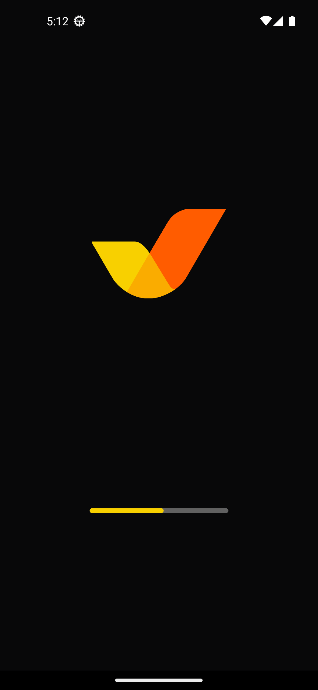
  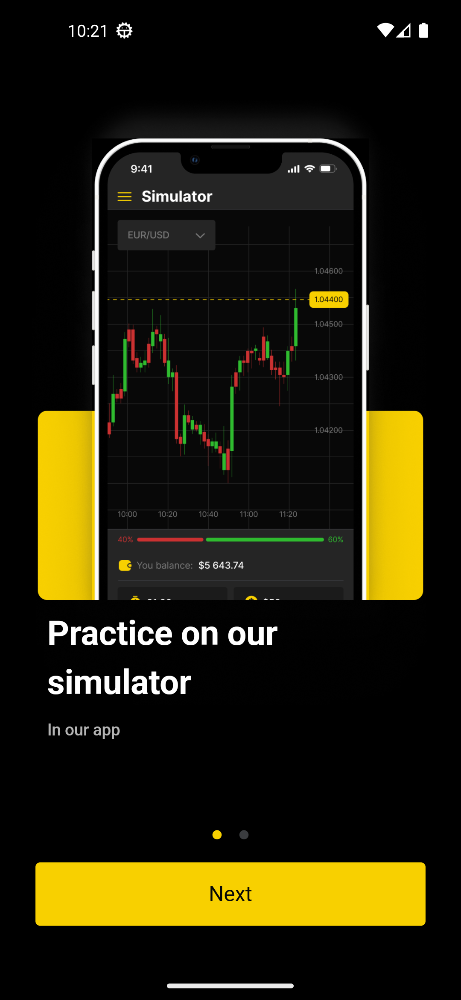
  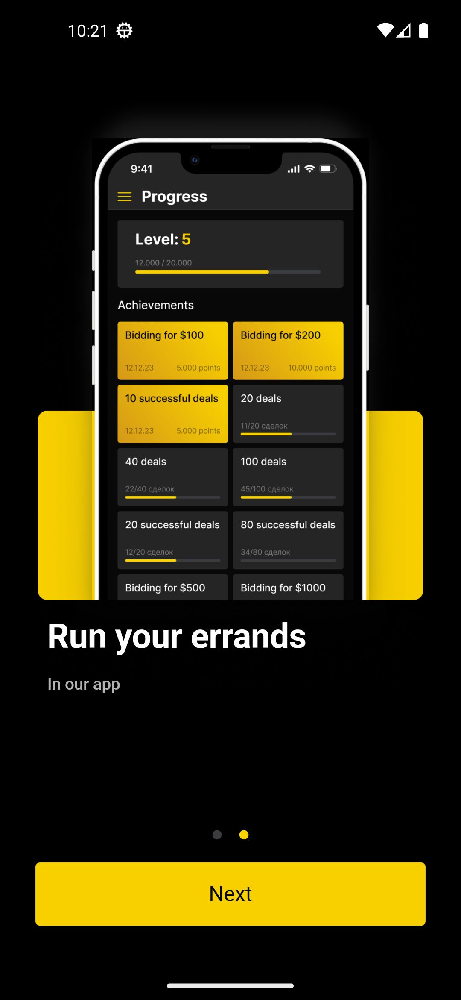

<h2 id="simulator">Simulator</h2>

This is where the main action happens, this screen allows you to pick trading pairs and make a bid on the	prices going up or down. You can also make more than 1 bid at a time, as well as cancel any bid you want.

  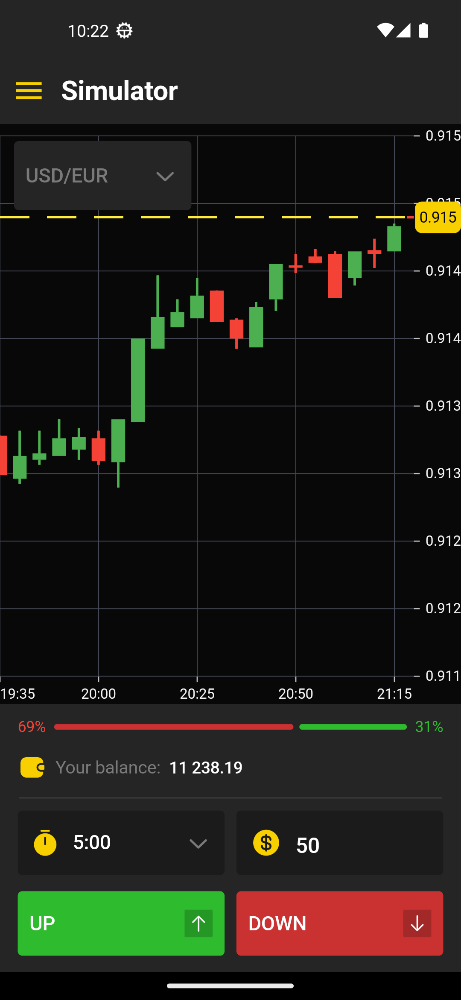
  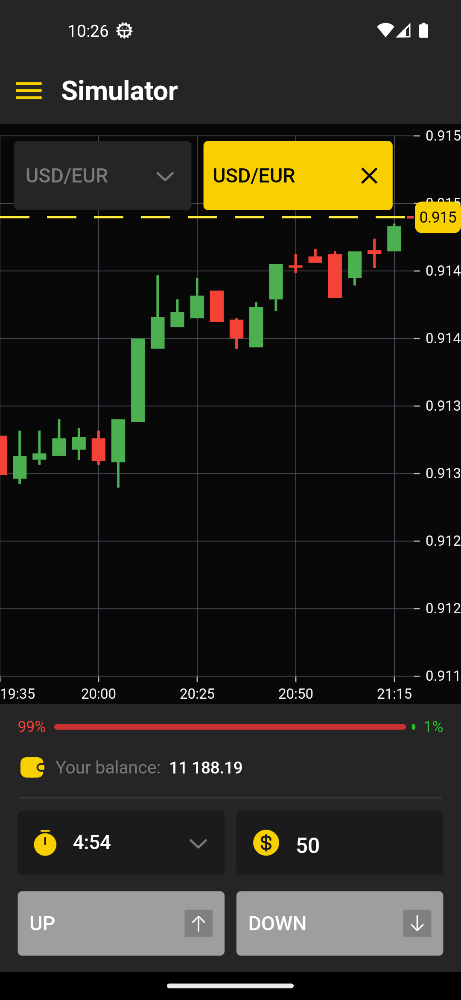
  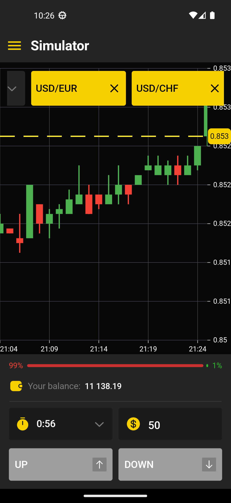

When the time is over, you get the results.

  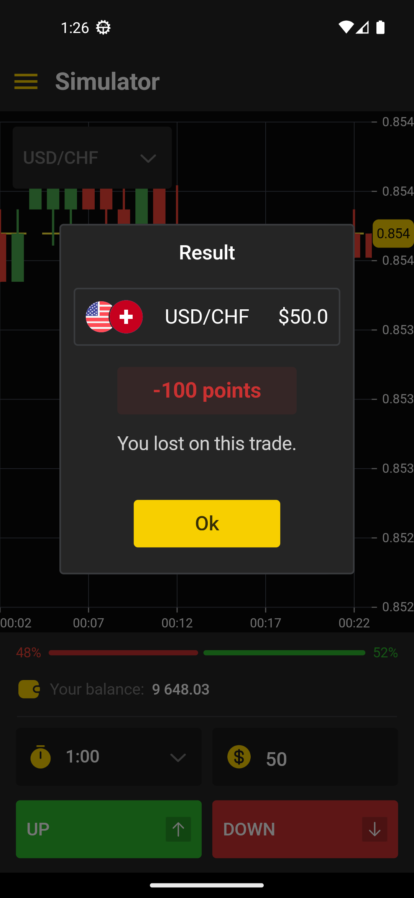
  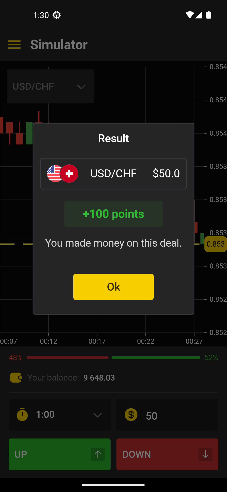

There's also embedded protection of the screen when the	app is in the background.

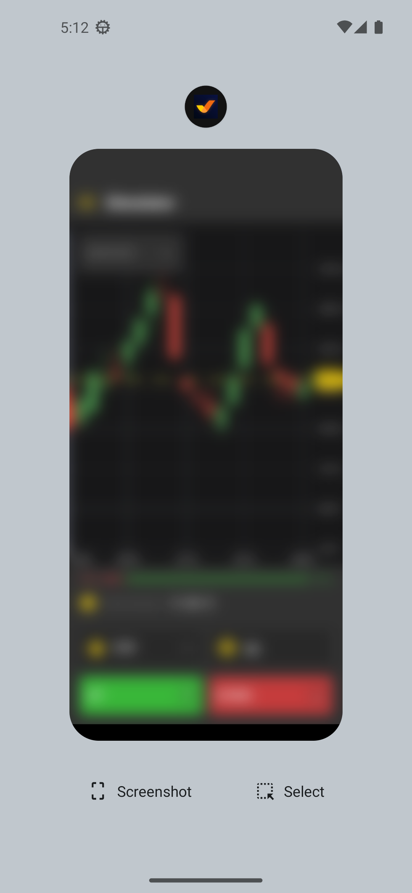

<h2 id="history">History</h2>

This screen is used to view current, as well as finished bids.

  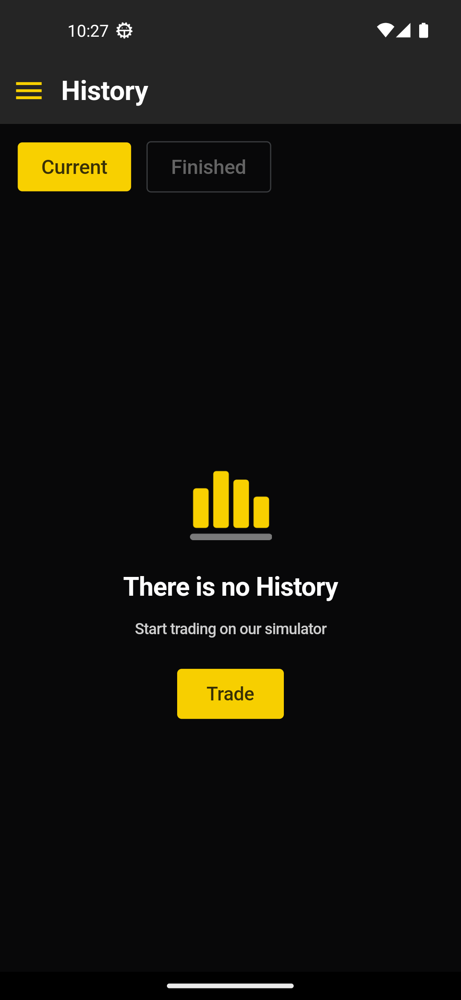
  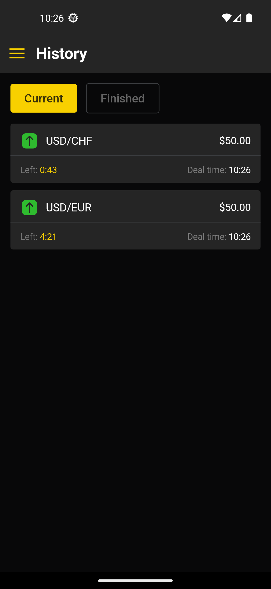
  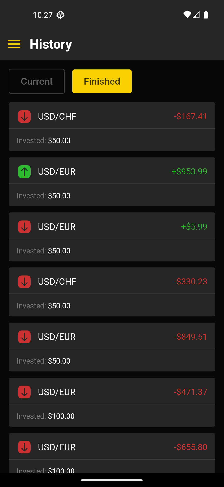

<h2 id="achievements">Achievements</h2>

This screen is for viewing the current progress, achievements and their status.

  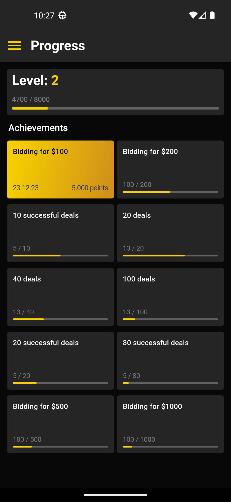
  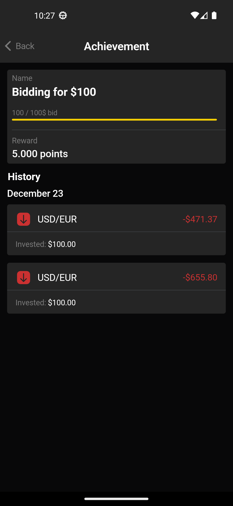
  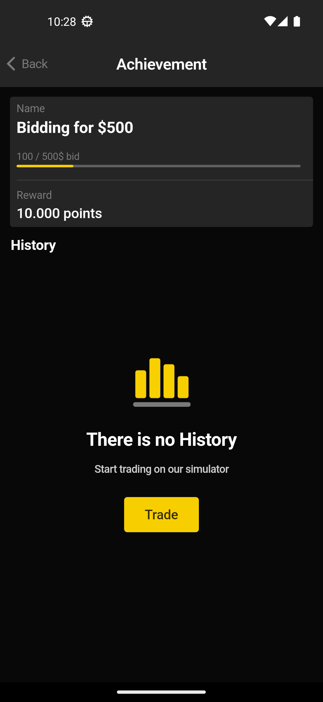

<h2 id="news">News</h2>

And, last but not least, the news screen - where all the important things in the world of trading are happening.

  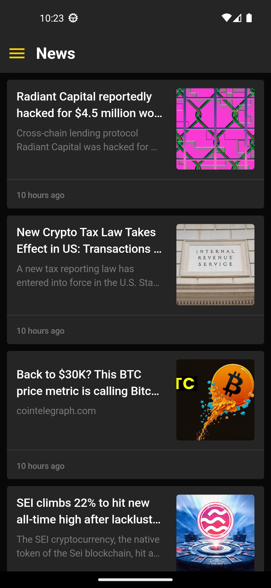
  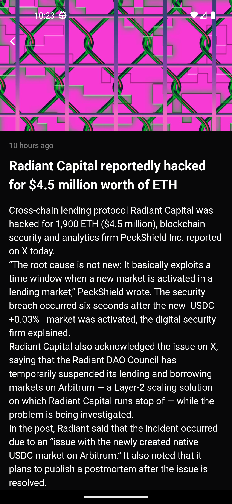

<h2 id="drawer">Drawer and Profile</h2>

Drawer is used for navigation, while profile screen allows the user to set the pfp and name.

  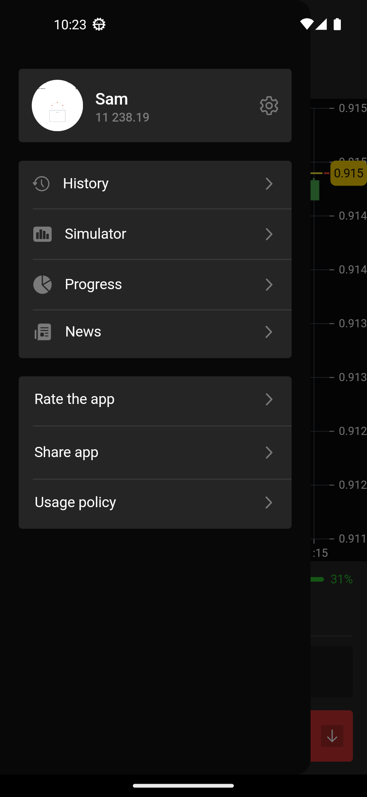
  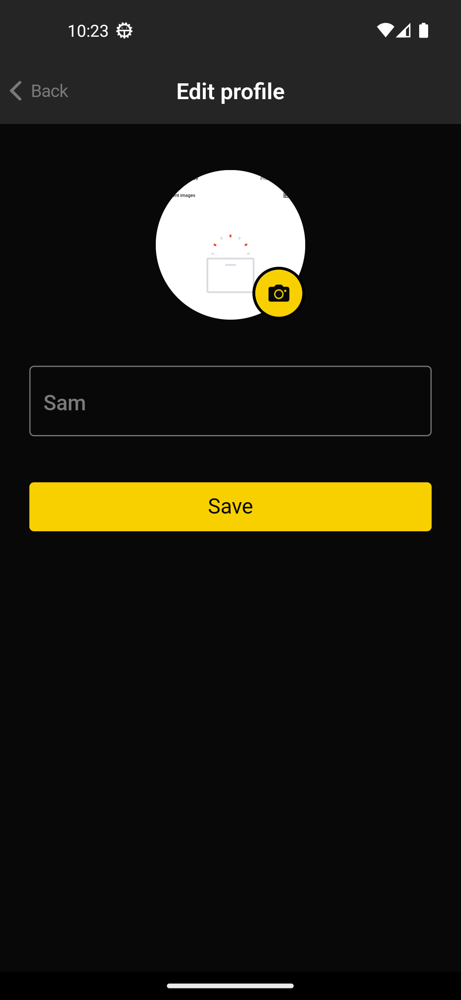

User can also share the app and view the policy.

  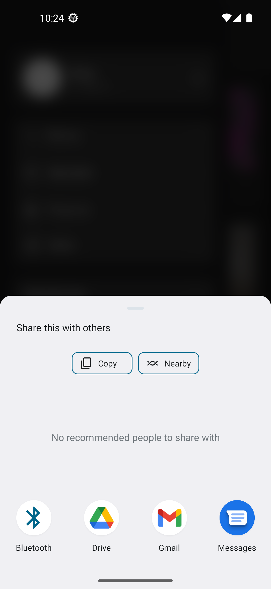
  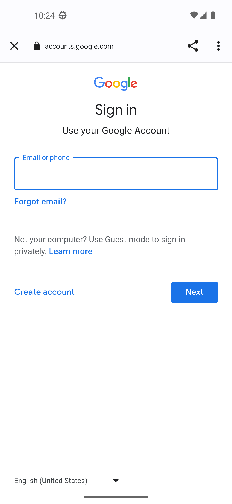

